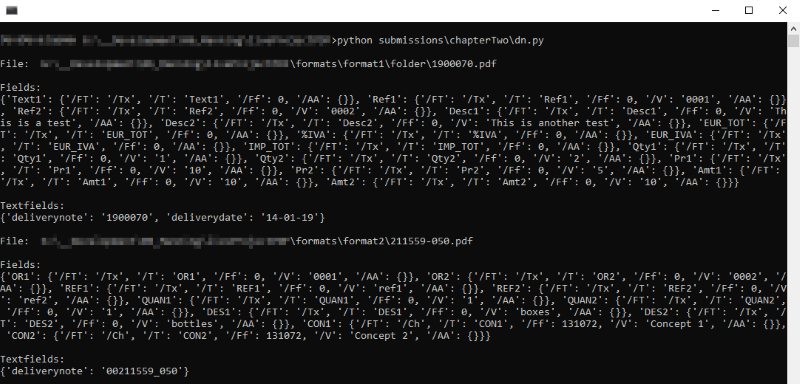

# **liveProject (MEAP):** Delivery Notes Data Entry Automation With Python
## Versionnumber 1.5.0 (2020-05-30)
(***Documentation last update 2020-05-30 19:00***)  

Here the task for each chapter will listed and optional Notes / Information

## ChapterOne

### Tasks
_go to portal for the tasks_

### Notes
* a virtual environment was created and the prerequisites were installed
* a 'requirements.txt' was generated with the installed local modules
* the demo files were kept in the same folder structure under 'formats' _(files are not under sourcecontrol)_
* to start the code of this Chapter just run `python -m chapterOne`
* Since the Submission structure is abit different, there is a sepearte folder, 'submissions' with the code that was submitted. 

### Output
`['...\\formats\\format1\\folder\\1900070.pdf', '...\\formats\\format2\\211559-050.pdf']`  
  
_**Disclaimer:** in my case I get a third file `.gitignore` is returned, but to keep it simple I didn't want to filter for fileextension or fileheader or ... . So I deleted the file in my working directory_

## ChapterTwo

### Tasks
_go to portal for the tasks_

### Notes
* added extra line in format2.ini 'DeliveryNote=Delivery'
* Currently output only as print-statements

### Output
