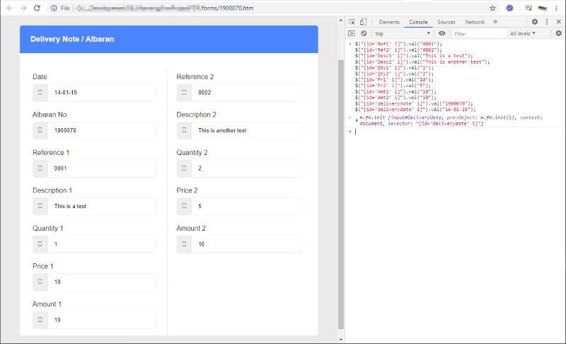
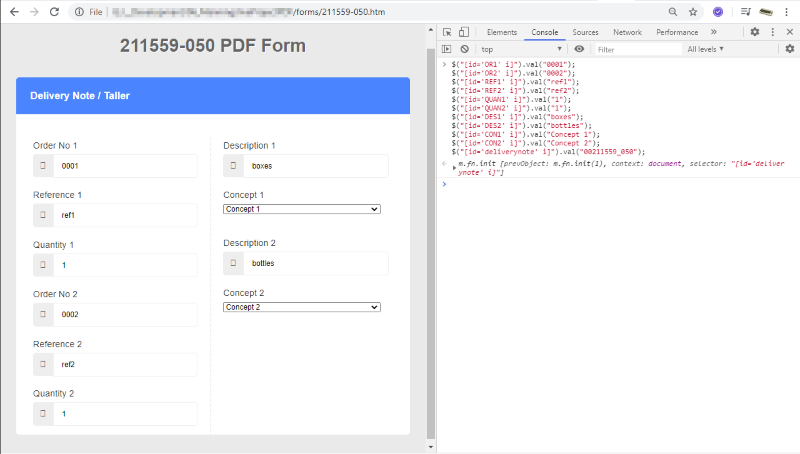

# Files for Chapter Three Submission

Some more details about the submission can be found in the readme of the repository.
Here is the link [Base Repository Readme](../../readme.md)

## Output  

_Since jQuery is used in the Form, to keep the script short it is used._  

It could also be done with vanilla Javascript, without the extra function. At least in Chrome 84+  

    // example:  
    document.querySelector("[id='CON1']").value = "Concept 1";

And since in selenium, you can choose your browser, this is a acceptable solution, for me.

### Form for PDF Format 1

### Form for PDF Format 2

